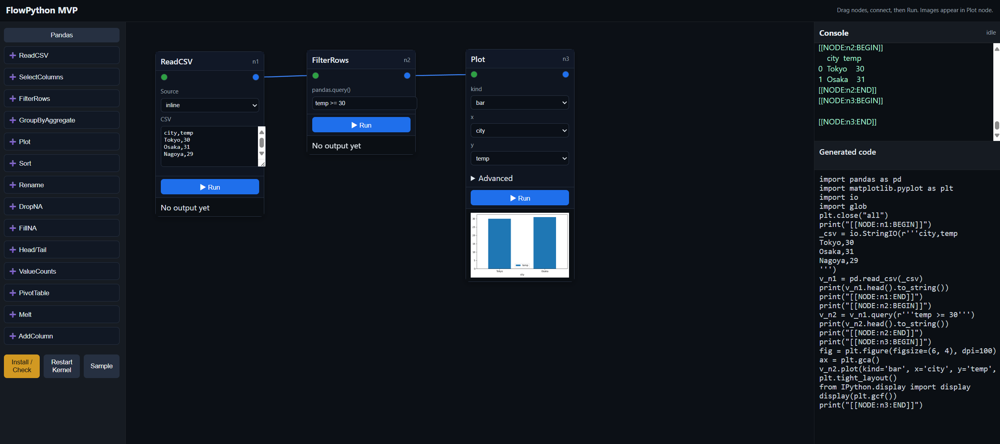

# PythonFlows

This is a minimal local-first prototype:
- Backend: FastAPI + Jupyter kernel via jupyter_client
- Frontend: static HTML/JS
- Flow: single-page UI that sends Python code to the kernel and streams iopub messages

Requirements (Windows, cmd.exe):
1) Install Python 3.10+ and ensure `python` is on PATH
2) Create and activate a virtual environment (optional but recommended)
3) Install backend requirements
4) Run the backend:
	Open a command prompt and run:
   
	```cmd
	.venv\Scripts\python -m uvicorn backend.main:app --reload --host 127.0.0.1 --port 8000
	```
5) Open http://localhost:8000 in your browser

Notes:
License:
- This repository is released under FlowPython Community Edition License (FP-CEL). Individuals are free to use; companies must contact us for commercial use or for more than one sheet. See LICENSE.md.

## Feature flags and licensing

The Jupyter kernel capability can be disabled for non-paid editions.

- Disable explicitly:
	- PowerShell: `$env:PYFLOWS_DISABLE_KERNEL = "1"`
- Enable explicitly (overrides disable):
	- PowerShell: `$env:PYFLOWS_ENABLE_KERNEL = "1"`
- License-gated (stub): set a license key plus optional allow flag in development:
	- `$env:PYFLOWS_LICENSE_KEY = "<your-license-key>"`
	- `$env:PYFLOWS_LICENSE_ALLOW = "1"`  # dev/test only, accepts any key

When disabled, `/run`, `/api/variables`, `/restart`, and `/ws` return 403 or an empty payload. `/health` returns `{ kernel: "disabled" }`.

## Use a remote kernel via Azure (Jupyter Enterprise Gateway)

You can run all code on a remote Jupyter Enterprise Gateway (e.g., deployed to Azure AKS/Container Apps) by setting environment variables before starting the backend.

- Prerequisites:
	- A reachable Enterprise Gateway endpoint (HTTPS recommended) that allows WebSocket upgrades.
	- An auth token if the gateway requires it.

- Environment variables (Windows PowerShell):
	- `$env:JUPYTER_GATEWAY_URL = "https://<your-gateway-host>/gateway"`
	- `$env:JUPYTER_GATEWAY_AUTH_TOKEN = "<optional-token>"`

- Start the backend after setting the variables. On startup you should see a log like:
	- `[Kernel] Using Jupyter Gateway: https://<your-gateway-host>/gateway`

Notes and tips:
- Networking: The backend server must be able to reach the gateway over HTTPS and upgrade to WebSockets (for IOPub, etc.). Ensure your Azure Ingress/Load Balancer permits `Upgrade: websocket`.
- CORS: Not required for the gateway itself, since the backend connects server-to-server. CORS for the frontend is already enabled on this FastAPI app.
- Dependencies: `jupyter_client>=8` is included and supports the gateway client. No extra package is needed for the client-side integration.
- Fallback: If the gateway module isn't available at runtime or the URL is not set, the app automatically falls back to a local kernel.

## Quick Guide (New Features)

- Variable template embedding
	- In any string field, `${varName}` is replaced with the current kernel global variable `varName`.
	- Supported examples: pandas.ReadCSV path/dir, inline CSV content, Python FileReadText path/inline, FileWriteCSV path.

- Unified expression evaluation
	- Python-side expressions use `_fp_eval()` which evaluates against kernel globals with optional locals (e.g., `df`).
	- `python.Math` accepts expressions like `df["a"] + alpha`.

- Variables inspector (right pane)
	- Switch with “Variables” button; shows a MATLAB-like table of Name/Type/Value.
	- Automatically refreshes after runs. When visible, you can click Variables again to refresh.

- Global variables
	- `python.SetGlobal`: assign multiple lines `name = expr`.
	- `python.GetGlobal`: import a chosen global into the flow as a DataFrame row.
	- Most forms include a “Load Variables” helper to click-insert variable names.
